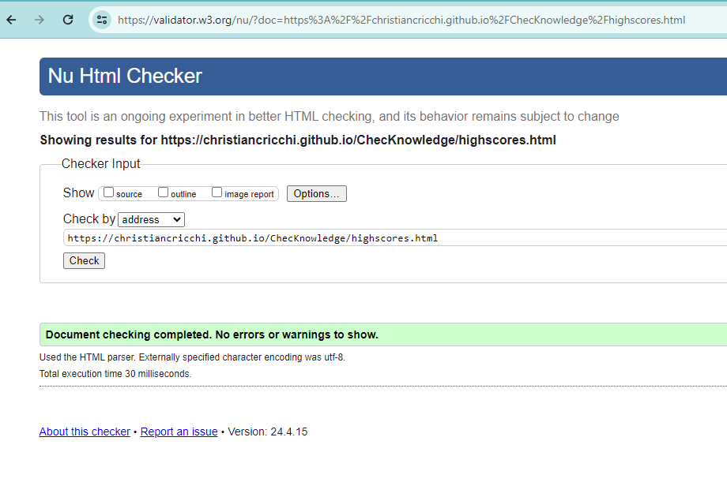
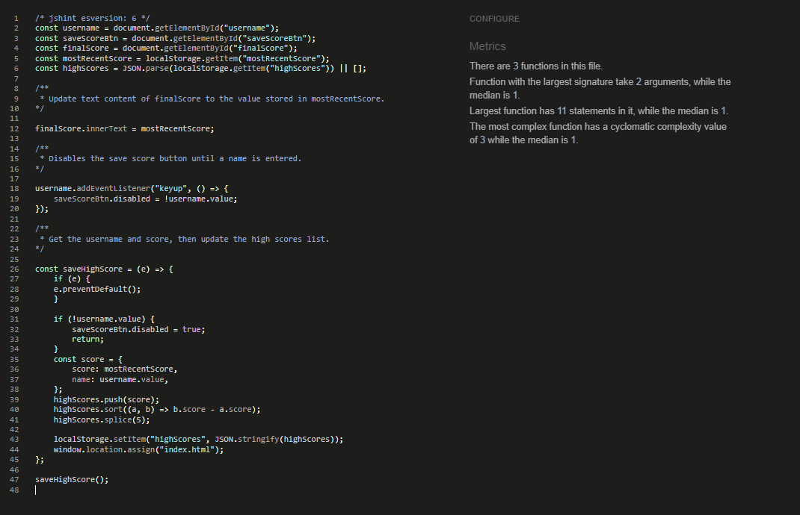

# **ChecKnowledge**

ChecKnowledge is an online game that allows users to test their knowledge by answering multiple-choice questions on different topics and differnt difficulty levels. The target audience that the game want to reach is people who like quiz, teams preparing for specific events, and anyone seeking entertaining way to pass their time. 

[The live link can be found here](https://christiancricchi.github.io/ChecKnowledge/)

## Site owner Goals
- To provide answer about user that are looking for a quiz game, with particulary focus on general knowledge.
- To provide the user a game app where teams can test their knowledge before an event or a competition.
- To provide the user with a game that is easy to navigate, fully responsive, that invokes a sense of relax and non-violence through the use of appropriate colors and layout.

## User Stories

### First time user
- As a first time user I want to understand the main purpose of the site.
- As a first time user I want to be able to intuitively navigate the website.
- As a first time user I want a fully responsive site.

### Returning User
- As a returning user I want to easily navigate to the ChecKnowledge game.
- As a returning user I want to choose different topics for the questions.
- As a returning user I want to choose the different level of questions.

### Frequent User
- As a frequent user I want to aswer different questions each time I play the game, even if I choose the same topic.

## Design
### Imagery
The imagery used on the CheKnowledge site is very important to the overall experience of the user. A relaxed lightseagreen background is consistently used. This invoke a sense of calm and non-violence in the user.

### Colours
The colour scheme of the page is lightseagreen, a navy and green font is used which as a good contrast with the 
lightseagreen background, with the green background of the buttons and the white of the dropdown buttons. For the question bar was used a blue navy margin color and a light gray for the bar, this contrast make it easy to see.

### Fonts

The Arial font is the main font used throughout the whole website. This font was imported via [Google Fonts](https://fonts.google.com/). I am using Sans Serif as a backup font, in case for any reason the main font is not being imported into the site correctly.

## Wireframes
Wireframes were produced using Balsamiq. 

 
Desktop Wireframe

 

 

    
Mobile Wireframe

 

 ## Features
- ### Home page
  - This simple and intuitive layout, the logo of the page and two buttons: "Start New Quiz  and HIgh Scores" gives the user a clear understanding of the available options, allowing the user to easily navigate to the desired activity.

       

- ### Start New Quiz
  - When the user clicks the "Start New Game" they are presented with teo dropdown menus:
    - **Topic Selection**
      This dropdown allows the user to choose the topic for the game.
    - **Difficulty Selection**
      The user can select the desired difficulty level for the game from this dropdown.
   Addictionaly, there is a:
   - **Submit Button**
     Once the user has made their selections from the two dropdowns menus and clicks the "Submit" button, the game will begin based on the choides made.

        

- ### Game Area
  - The game area includes a **progress bar** that automatically fills up based on the current question number the user is on. This features keeps the user informed about their progress throughthe game, showing how far the user has gone and how much is left until the end.
  - Alongside the progress bar, the game area features a **score display** that shows the user's current score. This score is calculated based on the number of questions the user has answered correctly so far.
  - The game does not simply repeat the same question over and over. Insted, the question content is dynamic, varying from one query to the next. This ensures that the user must actively engage with and respond to a diverse set of questions throughout the course of the game.
  - The game area also presents the user with a set of **multiple-choice answer**, there are four possible answers from which the user can select the response. When the user chooses an answer, the system provides immediate feedback. If the selected answer is correct, the corresponding answer box is highlighted in green, conversely if the answer is incorrect, the box is highlighted in red. After this feedback, the game automatically advances to the next question.

       

- ### End Game Page
  - The End page of the game has a few key features worrth highlighting:
    - **Score Summary** displays the user's final score, this allows the user to quickly see how they performed overall on the quiz.
    - **Save Name** in addictionto the final score display, the end page also allows users to save their result to a highscore leaderboard. To do this, the users are prompted to enter their name in a text field. Importantly, the **Save Score** button is disabled until the user has entered a name. This ensure that users cannot submit an empty name field.includes.
    - A **Play Again** button that allows users to restart the entire quiz if they wish to try it once more.
    - **Home** Users can quickly return to the home page by clicking the dedicated "Home" button.
  
         

## Features left to Implement

| Number | Feature |
| :---: | :---: |
| 1 | The High Score leaderbord could be improved to score scores on a server rather than a local storage. |
| 2 | To further enhance the user experience and provide more flexibility , an addictional dropdown menu could be added to the game page. This would allow the user to choose the number of questions they want to answer, enabling them to customise the game. |
| 3 |  By incorporating a progressive level system, the ChecKnowledge application could offer a more structured and challenging experience for users. As they progress through the levels, the difficulty of the questions and the overall game experience would gradually increase, providing a sense of progression and accomplishment. |

## Testing

### Validator Testing

- #### HTML
    - No errors were returned when passing through the official W3C Markup Validator

| File | Test | Pass | Image |
| :---: | :---: | :---: | :---: | 
| index.html | The test consists of placing the file in the Light and verifying that there are no errors. | Yes ||
| game.html | The test consists of placing the file in the validator and verifying that there are no errors. | Yes ||
| highscores.html | The test consists of placing the file in the validator and verifying that there are no errors. | Yes ||
| end.html | The test consists of placing the file in the validator and verifying that there are no errors. | Yes ||
| error.html | The test consists of placing the file in the validator and verifying that there are no errors. | Yes ||

- #### CSS
    - No errors were found when passing through the official W3C CSS Validator

| File | Test | Pass | Image |
| :---: | :---: | :---: | :---: | 
| end.js | The test consists of placing the file in the validator and verifying that there are no errors. | Yes ||
| game.js | The test consists of placing the file in the validator and verifying that there are no errors. | Yes ||
| highscores.css | The test consists of placing the file in the validator and verifying that there are no errors. | Yes ||

- #### JS
    - No errors were found when passing through the JavaScript validation from JSHint.com

| File | Test | Pass | Image |
| :---: | :---: | :---: | :---: | 
| end.js | The test consists of placing the file in the validator and verifying that there are no errors. | Yes ||
| game.js | The test consists of placing the file in the validator and verifying that there are no errors. | Yes ||
| score.js | The test consists of placing the file in the validator and verifying that there are no errors. | Yes ||

- #### Accessibility 
  - The site achieved a Lighthouse accessibility median score of 96% which confirms that the colours and fonts chosen are easy to read and accessible.

    - Desktop

| File | Test | Pass | Image |
| :---: | :---: | :---: | :---: | 
| index.html  | The test consists of placing the file in the Lighthouse google tools and verifying the accessibility of the site. Tested the desktop version. | Yes |
| highscores.html  | The test consists of placing the file in the Lighthouse google tools and verifying the accessibility of the site. Tested the desktop version. | Yes |
| game.html  | The test consists of placing the file in the Lighthouse google tools and verifying the accessibility of the site. Tested the desktop version. | Yes |
| error.html  | The test consists of placing the file in the Lighthouse google tools and verifying the accessibility of the site. Tested the desktop version. | Yes |
| end.html  | The test consists of placing the file in the Lighthouse google tools and verifying the accessibility of the site. Tested the desktop version. | Yes |

- #### Accessibility 
  - The site achieved a Lighthouse accessibility median score of 96% which confirms that the colours and fonts chosen are easy to read and accessible.

    - Mobile  

| File | Test | Pass | Image |
| :---: | :---: | :---: | :---: | 
| index.html  | The test consists of placing the file in the Lighthouse google tools and verifying the accessibility of the site. Tested the desktop version. | Yes |
| highscores.html  | The test consists of placing the file in the Lighthouse google tools and verifying the accessibility of the site. Tested the desktop version. | Yes |
| game.html  | The test consists of placing the file in the Lighthouse google tools and verifying the accessibility of the site. Tested the desktop version. | Yes |
| error.html  | The test consists of placing the file in the Lighthouse google tools and verifying the accessibility of the site. Tested the desktop version. | Yes |
| end.html  | The test consists of placing the file in the Lighthouse google tools and verifying the accessibility of the site. Tested the desktop version. | Yes |

  - The accessibility was also tested on wave.webaim.org.

| File | Test | Pass | Image |
| :---: | :---: | :---: | :---: | 
| index.html  | The test consists of placing the file in the wave.webaim.org and verifying the accessibility of the site. | Yes |
| highscores.html  | The test consists of placing the file in the wave.webaim.org and verifying the accessibility of the site. | Yes |
| game.html  | The test consists of placing the file in the wave.webaim.org and verifying the accessibility of the site. | Yes |
| error.html  | The test consists of placing the file in the wave.webaim.org and verifying the accessibility of the site. | Yes |
| end.html  | The test consists of placing the file in the wave.webaim.org and verifying the accessibility of the site. | Yes |

- ### Testing User Stories
  I set some manual test to test the User Stories.

| Name | Test | Result | Pass |
| :---: | :---: | :---: | :---: | 
| Test 1 | As a user, I want the site to be intuitive, so I can quickly find the functionality. | All acceptance for the intuitive quiz experience have been met, as verified through user testing. | Yes |
| Test 2 | As a user, I want the site to be responsive. | All acceptance criteria for responsive quiz have been meet, as verified through comprehensive testing on a variety of devices and browsers | Yes |
| Test 3 | As a user, I want to be able to choose the topic for the questions. | All acceptance criteria for the topic selection have been meet, as verified through user testing. | Yes |
| Test 4 | As a user, I want that the quiz should have a large, diverse pool of questions for each available topic. | All acceptance criteria for dynamic have been meet, as verified through comprehensive user testing. | Yes |

### Browser Testing
- The Website was tested on Google Chrome, Firefox, Microsoft Edge, Safari browsers with no issues noted.
    
### Device Testing
- The website was viewed on a variety of devices such as Desktop, Laptop, iPhone 8, iPhoneX and iPad to ensure responsiveness on various screen sizes. The website performed as intended. The responsive design was also checked using Chrome developer tools across multiple devices with structural integrity holding for the various sizes.
- I also used the following websites to test responsiveness:
    - [Responsinator](http://www.responsinator.com/?url=https%3A%2F%2Fchristiancricchi.github.io%2FChecKnowledge%2F)
    - [Am I Responsive](https://ui.dev/amiresponsive?url=https://christiancricchi.github.io/ChecKnowledge/)

### Friends and Family User Testing
Friends and family members were asked to review the site and documentation to point out any bugs and/or user experience issues.

## Bugs

| Bug | Problem | Cause | Solution |
| :---: | :---: | :---: | :---: | 
| GitHub page | When the project was deployed in GitHub PAges and "Start Quiz" button was clicked, a 404 "Page NOt Found" error is displayed.| GitHub Pages does not handle absolute file paths well. When the application is deployed to GitHUb Pages, the absolute file paths used to send the user to the relevant page based on the button clicked action taken are no longer valid, leading to the 404 Error | To resolve the issue with the 404 "Page Not Found", the solution was to change all file paths in the project's documents from absolute to relative. |
| Easy Difficulty Issue | When attempting to start he quiz without modifing the defaul dropdown options for topic difficulty, the quiz does not launch like expected, the application immediately jumps to the end page, bypassing the quiz functionality | The root cause of the problem was related to the difficulty selection dropdown. The application was unable to properly determine the actual value of the difficulty selection until the user physically selected an option from the dropdown menu. | To address the problem the "game.js" file was updated. The goal was to ensure that the application could properly recognise ad handle the default "easy" difficulty, even if it was not physically selected by the user. |

## Technologies Used

### Languages
- HTML5
- CSS
- JavaScript

### Frameworks - Libraries - Programs Used
- [Am I Responsive](http://ami.responsivedesign.is/) - Used to verify responsiveness of website on different devices.
- [Responsinator](http://www.responsinator.com/) - Used to verify responsiveness of website on different devices.
- [Balsamiq](https://balsamiq.com/) - Used to generate Wireframe images.
- [Chrome Dev Tools](https://developer.chrome.com/docs/devtools/) - Used for overall development and tweaking, including testing responsiveness and performance.
- [Font Awesome](https://fontawesome.com/) - Used for Social Media icons in footer.
- [GitHub](https://github.com/) - Used for version control and hosting.
- [Google Fonts](https://fonts.google.com/) - Used to import and alter fonts on the page.
- [TinyPNG](https://tinypng.com/) - Used to compress images to reduce file size without a reduction in quality.
- [W3C](https://www.w3.org/) - Used for HTML & CSS Validation.
- [JavaScript Validation](https://JSHint.com) - Used to validate the JavaScript code.

## Deployment

The project was deployed using GitHub pages. The steps to deploy using GitHub pages are:

1. Go to the repository on GitHub.com
2. Select 'Settings' near the top of the page.
3. Select 'Pages' from the menu bar on the left of the page.
4. Under 'Source' select the 'Branch' dropdown menu and select the main branch.
5. Once selected, click the 'Save'.
6. Deployment should be confirmed by a message on a green background saying "Your site is published at" followed by the web address.

The live link can be found here - [ChecKnowledge](https://christiancricchi.github.io/ChecKnowledge/)

## Credits

### Content
All educational content was sourced from the below websites:
- [Tutorial to create the game](https://www.youtube.com/watch?v=rFWbAj40JrQ)
- [Loading Spinner](https://www.w3schools.com/howto/howto_css_loader.asp)

### Media
All images and videos were sourced from the below websites.
- [Logo](https://logo.com/)
- [Favicon](https://favicon.io/)

## Acknowledgments

My lovely wife Vivian for her support, advice and help in the crisis moments.

My mentor Antonio for his support and advice.

Amy for the interesting and useful information shared on oct-2023-pla weekly meeting

The Code Institute slack community for their quick responses and very helpful feedback!  

