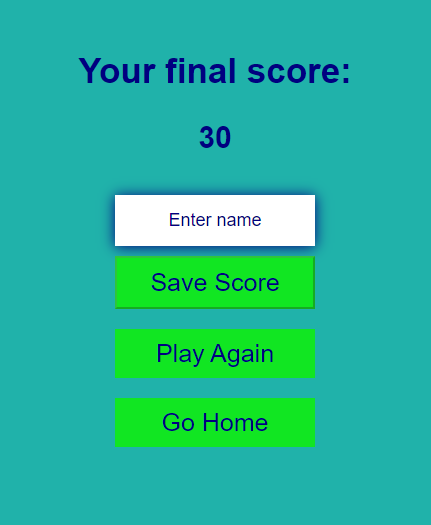

# **ChecKnowledge**

ChecKnowledge is an online game that allows users to test their knowledge by answering multiple-choice questions on different topics and differnt difficulty levels. The target audience that the game want to reach is people who like quiz, teams preparing for specific events, and anyone seeking entertaining way to pass their time. 

[The live link can be found here](https://christiancricchi.github.io/ChecKnowledge/)

## Site owner Goals
- To provide answer about user that are looking for a quiz game, with particulary focus on general knowledge.
- To provide the user a game app where teams can test their knowledge before an event or a competition.
- To provide the user with a game that is easy to navigate, fully responsive, that invokes a sense of relax and non-violence through the use of appropriate colors and layout.

## User Stories

### First time user
- As a first time user I want to understand the main purpose of the site.
- As a first time user I want to be able to intuitively navigate the website.
- As a first time user I want a fully responsive site.

### Returning User
- As a returning user I want to easily navigate to the ChecKnowledge game.
- As a returning user I want to choose different topics for the questions.
- As a returning user I want to choose the different level of questions.

### Frequent User
- As a frequent user I want to aswer different questions each time I play the game, even if I choose the same topic.

## Design
### Imagery
The imagery used on the CheKnowledge site is very important to the overall experience of the user. A relaxed lightseagreen background is consistently used. This invoke a sense of calm and non-violence in the user.

### Colours
The colour scheme of the page is lightseagreen, a navy and green font is used which as a good contrast with the 
lightseagreen background, with the grey background of the buttons and the white of the dropdown buttons. For the question bar was used a blue navy margin color and a light gray for the bar, this contrast make it easy to see.

### Fonts

The Arial font is the main font used throughout the whole website. This font was imported via [Google Fonts](https://fonts.google.com/). I am using Sans Serif as a backup font, in case for any reason the main font is not being imported into the site correctly.

## Wireframes
Wireframes were produced using Balsamiq. 

 
Desktop Wireframe

 

 

    
Mobile Wireframe

 

 ## Features
- ### Home page
  - This simple and intuitive layout, the logo of the page and two buttons: "Start New Quiz  and HIgh Scores" gives the user a clear understanding of the available options, allowing the user to easily navigate to the desired activity.

       

- ### Start New Quiz
  - When the user clicks the "Start New Game" they are presented with teo dropdown menus:
    - **Topic Selection**
      This dropdown allows the user to choose the topic for the game.
    - **Difficulty Selection**
      The user can select the desired difficulty level for the game from this dropdown.
   Addictionaly, there is a:
   - **Submit Button**
     Once the user has made their selections from the two dropdowns menus and clicks the "Submit" button, the game will begin based on the choides made.

        

- ### Game Area
  - The game area includes a **progress bar** that automatically fills up based on the current question number the user is on. This features keeps the user informed about their progress throughthe game, showing how far the user has gone and how much is left until the end.
  - Alongside the progress bar, the game area features a **score display** that shows the user's current score. This score is calculated based on the number of questions the user has answered correctly so far.
  - The game does not simply repeat the same question over and over. Insted, the question content is dynamic, varying from one query to the next. This ensures that the user must actively engage with and respond to a diverse set of questions throughout the course of the game.
  - The game area also presents the user with a set of **multiple-choice answer**, there are four possible answers from which the user can select the response. When the user chooses an answer, the system provides immediate feedback. If the selected answer is correct, the corresponding answer box is highlighted in green, conversely if the answer is incorrect, the box is highlighted in red. After this feedback, the game automatically advances to the next question.

       

- ### End Game Page
  - The End page of the game has a few key features worrth highlighting:
    - **Score Summary** displays the user's final score, this allows the user to quickly see how they performed overall on the quiz.
    - **Save Name** in addictionto the final score display, the end page also allows users to save their result to a highscore leaderboard. To do this, the users are prompted to enter their name in a text field. Importantly, the **Save Score** button is disabled until the user has entered a name. This ensure that users cannot submit an empty name field.includes.
    - A **Play Again** button that allows users to restart the entire quiz if they wish to try it once more.
    - **Home** Users can quickly return to the home page by clicking the dedicated "Home" button.
  
         

## Testing

### Validator Testing

- #### HTML
    - No errors were returned when passing through the official W3C Markup Validator

| File | Test | Pass | Image |
| :---: | :---: | :---: | :---: | 
| index.html | The test consists of placing the file in the validator and verifying that there are no errors. | Yes ||
| game.html | The test consists of placing the file in the validator and verifying that there are no errors. | Yes ||
| highscores.html | The test consists of placing the file in the validator and verifying that there are no errors. | Yes ||
| end.html | The test consists of placing the file in the validator and verifying that there are no errors. | Yes ||
| error.html | The test consists of placing the file in the validator and verifying that there are no errors. | Yes ||

- #### CSS
    - No errors were found when passing through the official W3C CSS Validator

| File | Test | Pass | Image |
| :---: | :---: | :---: | :---: | 
| end.js | The test consists of placing the file in the validator and verifying that there are no errors. | Yes ||
| game.js | The test consists of placing the file in the validator and verifying that there are no errors. | Yes ||
| highscores.css | The test consists of placing the file in the validator and verifying that there are no errors. | Yes ||

- #### JS
    - No errors were found when passing through the JavaScript validation from JSHint.com

| File | Test | Pass | Image |
| :---: | :---: | :---: | :---: | 
| end.js | The test consists of placing the file in the validator and verifying that there are no errors. | Yes ||
| game.js | The test consists of placing the file in the validator and verifying that there are no errors. | Yes ||
| score.js | The test consists of placing the file in the validator and verifying that there are no errors. | Yes ||

- #### Accessibility 
    - The site achieved a Lighthouse accessibility score of 100% which confirms that the colours and fonts chosen are easy to read and accessible

| File | Test | Pass | Image |
| :---: | :---: | :---: | :---: | 
|  | The test consists of placing the file in the validator and verifying that there are no errors. | Yes |[The live link can be found here](https://googlechrome.github.io/lighthouse/viewer/?psiurl=https%3A%2F%2Fchristiancricchi.github.io%2FChecKnowledge%2Findex.html&strategy=mobile&category=performance&category=accessibility&category=best-practices&category=seo&category=pwa&utm_source=lh-chrome-ext)|

